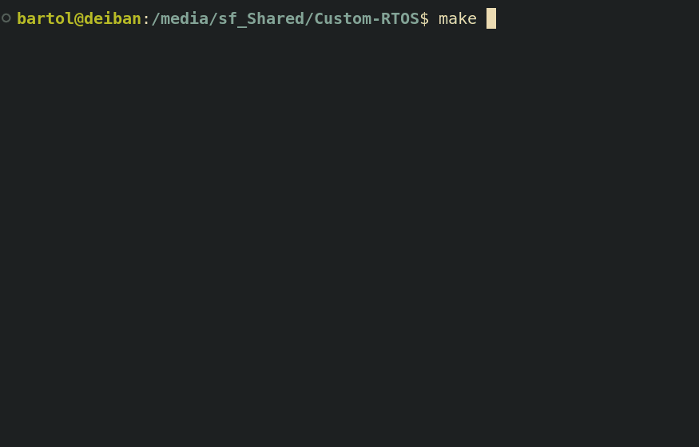

# Custom RTOS

A preemptive, priority based RTOS for ARM Cortex-M3, written from scratch in C and assembly 
No SDK, no libc, no third-party kernel code




Runs multiple tasks concurrently on a single core, switching between them via a hardware timer driven preemptive scheduler
Tasks have priorities, can sleep, and coordinate through synchronization primitives

The demo simulates a sensor monitoring system: a high-priority sensor task reads values and signals a processor task via a semaphore, which stores results in a shared structure protected by a mutex, while a logger task prints status periodically

RTOS booting
System running
[t=1000ms] sensor=988 processed=494 (readings: 1)
[t=2001ms] sensor=772 processed=386 (readings: 2)
[t=3001ms] sensor=613 processed=306 (readings: 3)
[t=4001ms] sensor=426 processed=213 (readings: 4)

## Features

- Bare-metal boot: custom linker script, startup code, vector table
- UART driver via memory-mapped I/O
- Context switch in hand written ARMv7-M assembly, PendSV exception
- Preemptive priority scheduling driven by the SysTick timer
- Priority ready queues with round-robin within a level
- Timed sleep (`rtos_sleep`), blocked tasks consume zero CPU
- Counting semaphore with direct handoff
- Mutex with priority inheritance preventing priority inversion
- Idle task

## Target

Emulated ARM Cortex-M3 via QEMU (`mps2-an385` board)
No physical hardware required

## Build & run

Install the toolchain (Debian/Ubuntu):

```bash
sudo apt install qemu-system-arm gcc-arm-none-eabi gdb-multiarch make
```

Build and run:

```bash
make
make run       
```
See [ARCHITECTURE.md](ARCHITECTURE.md) for the boot sequence, context switch, scheduler, and synchronization primitives